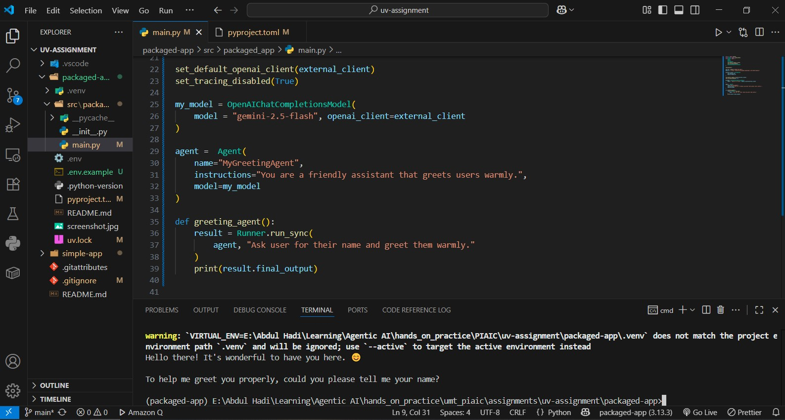

# AI Greeting Agent - Packaged App

**Author:** Abdul Hadi  
**PIAIC Registration:** PIAIC228505

Packaged AI greeting agent using OpenAI Agents library with Gemini 2.5 Flash model.

## App Output



## Features

- Interactive AI greeting agent
- Gemini 2.5 Flash model integration
- Console script entry point
- Modular package structure
- Environment-based configuration

## Setup

1. Create `.env` file:

```
GEMINI_API_KEY=your_api_key_here
```

2. Install dependencies:

```bash
uv sync
```

3. Run using console script:

```bash
uv run run_agent
```

## Console Scripts

- `run_agent`: Executes the AI greeting agent

## Dependencies

- openai-agents>=0.2.11
- python-dotenv
