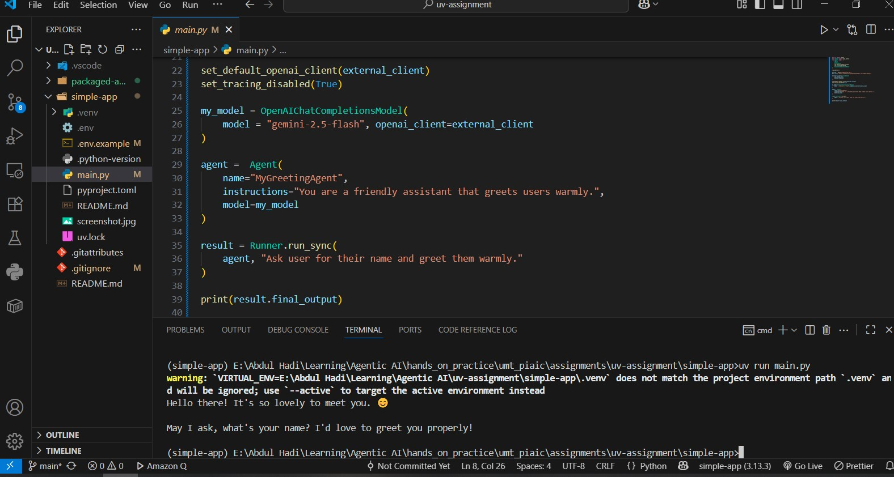

# Simple App

**Author:** Abdul Hadi  
**PIAIC Registration:** PIAIC228505

A simple Python application demonstrating UV package management with OpenAI agents dependency.

## Features
- Uses UV for dependency management
- Includes OpenAI agents library
- Python 3.13+ compatible

## Setup

1. Install dependencies:
```bash
uv sync
```

2. Run the application:
```bash
uv run python main.py
```

## Dependencies
- openai-agents>=0.2.11
- Python >=3.13

## App Output


